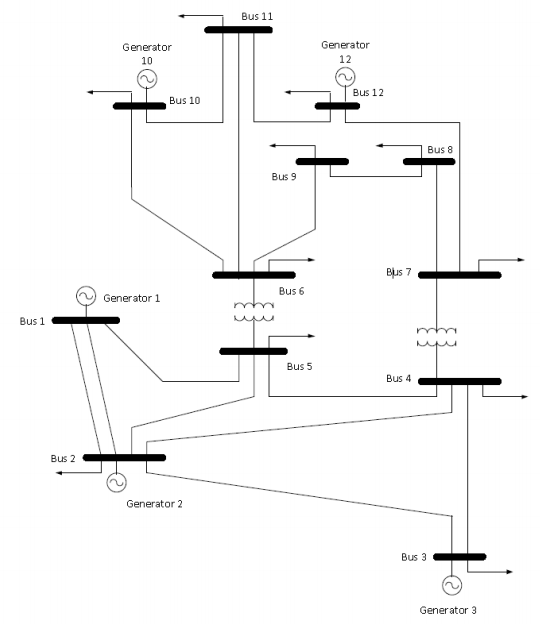

# EE 454 Final Project

## Power System Analysis

### Overview

This program analyzes a power system and solves for bus voltages using the Newton-Raphson method.

### Arguments

The program accepts the following arguments:

* input_workbook: The name of the Excel workbook containing bus and line data (default: "data/Data.xlsx").
* bus_data_worksheet: The name of the worksheet containing bus data (default: "Bus data").
* line_data_worksheet: The name of the worksheet containing line data (default: "Line data").
* start_voltage_magnitude: The initial voltage in per-unit to set for each unknown bus voltage (default: 1 pu).
* start_voltage_angle_deg: The initial voltage phase angle in degrees to set for each unknown bus voltage (default: 0 degrees).
* slack_bus_number: The slack bus number (default: 1).
* power_base_mva: The power base in MVA (default: 100).
* max_mismatch_mw: The maximum allowed real power mismatch in MW (default: 0.1).
* max_mismatch_mvar: The maximum allowed reactive power mismatch in Mvar (default: 0.1).

### Input Format

The input is expected to be an Excel workbook with two worksheets: one for bus data and another for line data.

#### Bus data

The worksheet containing bus data is expected to have the following columns:

1. Bus number
2. Real power consumed (MW)
3. Reactive power consumed (Mvar)
4. Real power delivered (MW)
5. Voltage (pu)

#### Line data

The worksheet containing line data is expected to have the following columns:

1. Source bus
2. Destination bus
3. Total resistance (pu)
4. Total reactance (pu)
5. Total susceptance (pu)
6. Maximum rated power (MVA)

### Reference Power System

Some sample inputs are provided in the "data" subdirectory. The reference case for this program is a 12-bus system specified in "data/Data.xlsx." A diagram for this system is shown below.

